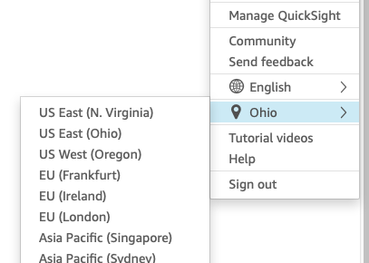
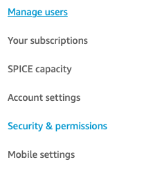
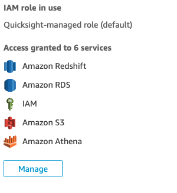
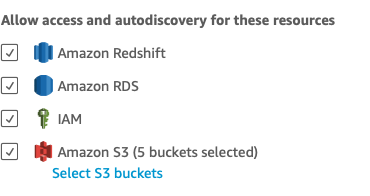

# twitter-ai-analysis-pipeline
### Description

With this repo you can build a social media analysis application with Athena and Quicksight. 
Once the stack is created, tweets will stream in from the Twitter API. Then the tweets
are sent to deep learning models for entity extraction and sentiment inference. Lambda execution 
speed is enhanced by the attached Elastic File System because the models are stored there. Only 
on the initial Lambda invocation is delayed by the initial download. The models are open source, 
so this keeps costs down as opposed to calling AWS services for the same inference. The pipeline 
is completed as the data is sent to S3 where it is available to Athena. From there you can 
query, join, or aggregate the tables to create analyses in Quicksight.

---

### Project Set Up
#### Twitter Account and Credentials
You will need to set up a developer account and get access keys to the API. 
[Here is where to get started.](https://developer.twitter.com/en/docs/twitter-api/getting-started/about-twitter-api)

#### Ingestion image set up

The Lambda function for ingestion runs every 15 minutes. To keep costs down it
streams for 5 minutes and is configured to timeout after that. You can change this by
changing the time_limit parameter in the TwitterStreamListener class. 
You'll need to change the query terms supplied to the Twitter API. Open the
file `serverless-functions/stream-lambda/stream.py.` On line 129 change
the tracking terms to something you'd like to track.

#### Push the images to ECR 
*Note: You will need to change the bucket variable in each of the python files to 
match yours in PredictionBucketName.*

You'll need to build and push the images to ECR for the Lambda functions to be deployed. 
Do this by changing directory to one of the directories in `serverless-functions`. Then
run the following:
- In `serverless-functions/stream-lambda` run `./../aws-ecr-push.sh twitter-ingestion-stream`

- In `serverless-functions/sentiment` run `./../aws-ecr-push.sh twitter-roberta-sentiment`

- In `serverless-functions/name-entity-recognition` run `./../aws-ecr-push.sh ner-inference`

There are corresponding template Parameters in `ml-streaming-pipeline.yaml` for each repo name. 
Make sure these Parameters match up with the repo names you use when pushing the repos to ECR.

---

### Running this Family of Templates
You'll need to send the nested templates to the specified S3 bucket so CloudFormation 
will be able to get then when deploying the Stacks. From the base directory run:

`./bin/deploy ml-streaming-pipeline`

After those files have been delivered to your bucket, go to CloudFormation console in your AWS account. 
Use the parent template, named `ml-streaming-pipeline.yaml` in this repo to build the stacks. Check your 
Parameter values and proceed on to deploy the Stack. 

---

### QuickSight Visualizations
To set up an Analysis in QuickSight, you'll have to do some manual steps. Open QuickSight
and click on your user tab n the top right hand of the screen.

Switch to us-east-1 

Click Manage QuickSight 

Click on Security & permissions 

Click on Manage 

Click on Select S3 buckets and allow access to the S3 PredictionBucket created in the template 

 
Then you can go to Athena in the AWS console and run the SQL command supplied in 
`misc/athena-create-table.txt`.
Finally, follow this tutorial to [Create an Analysis](https://docs.aws.amazon.com/quicksight/latest/user/example-create-an-analysis.html).
Be sure to select the `social_media_dashboard_database` database created by the stack. 
Then select the tweets_sentiments_entities table created in Athena. 
Now you're able to put together any visualization you see fit.  
